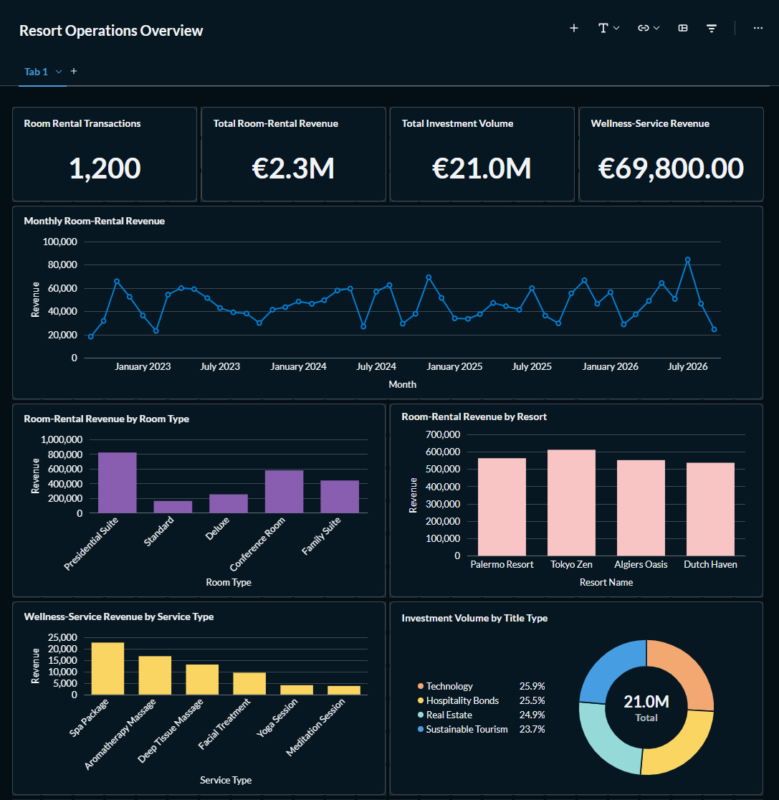
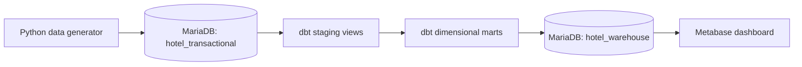

# Resort Data Warehouse Pipeline

[](https://www.python.org/)
[](https://mariadb.org/)
[](https://www.getdbt.com/)
[](https://www.metabase.com/)
[](https://www.docker.com/)
[](#architecture)

An end-to-end data engineering and business intelligence project that generates synthetic resort operations data, transforms it into a dimensional warehouse with dbt, and presents operational insights in Metabase.

## Overview

The project models three resort business processes:

- Room rentals
- Wellness-service usage
- Investment activity

Python scripts create a normalized transactional source database in MariaDB. dbt then transforms it into an analytical warehouse organized around dimensions and facts.

All records are synthetic and generated with a fixed random seed. Transaction dates are relative to the execution date.

## Dashboard



The dashboard includes:

- Total room-rental revenue and rental transaction count
- Monthly room-rental revenue trend
- Revenue by room type and resort
- Wellness-service revenue by service type
- Simulated investment volume by title type

## Architecture



More detail: [architecture documentation](docs/architecture.md).

## Dimensional Model

The warehouse uses a star-schema-oriented design.

| Model | Grain | Purpose |
|---|---|---|
| `dim_date` | One row per distinct business-process date |
| `dim_person` | One row per person | Customer demographic attributes |
| `dim_room` | One row per room | Room, hotel, and resort attributes |
| `dim_service` | One row per wellness service | Service, wellness center, and resort attributes |
| `dim_investment_title` | One row per investment title | Investment-title attributes |
| `fact_room_rental` | One row per room-rental transaction | Rental duration and room revenue |
| `fact_rental_service` | One row per wellness-service usage | Service revenue |
| `fact_investment` | One row per investment transaction | Simulated investment amount and duration |

## Repository Structure

```text
.
├── dbt/
│   └── my_resort_project/
│       ├── dbt_project.yml
│       └── models/
│           ├── marts/
│           ├── staging/
│           └── sources.yml
├── docs/
│   ├── architecture.md
│   ├── baseline/
│   └── images/
├── init/
│   ├── generate_data.py
│   ├── reset_databases.py
│   └── setup_database.py
├── .env.example
├── requirements.txt
└── README.md
```

## Technology Stack

| Area | Tools |
|---|---|
| Data generation | Python, Faker |
| Transactional and warehouse storage | MariaDB |
| Data transformation | dbt Core, dbt-mariadb |
| Data quality | dbt generic tests |
| Business intelligence | Metabase |
| Local configuration | Python virtual environment, `.env` |

## Data Volume

The default generator creates:

| Dataset | Rows |
|---|---:|
| People | 300 |
| Rooms | 40 |
| Wellness services | 6 |
| Investment titles | 4 |
| Room-rental transactions | 1,200 |
| Wellness-service usage transactions | 700 |
| Investment transactions | 400 |

The dbt project currently builds 18 models and runs 25 data-quality tests.

## Prerequisites

- Python 3.10 or later (Python 3.12 tested)
- MariaDB running locally and reachable on port `3307`
- dbt Core with the `dbt-mariadb` adapter
- Docker Desktop only if you want to run Metabase locally

## Setup

### 1. Create and activate a virtual environment

```powershell
python -m venv .venv
.\.venv\Scripts\Activate.ps1
```

### 2. Install Python dependencies

```powershell
python -m pip install --upgrade pip
pip install -r requirements.txt
```

### 3. Configure the database connection

Copy the example configuration:

```powershell
Copy-Item .env.example .env
```

Update `.env` if your local MariaDB connection differs:

```env
MYSQL_HOST=127.0.0.1
MYSQL_PORT=3307
MYSQL_USER=root
MYSQL_PASSWORD=
MYSQL_TRANSACTIONAL_DB=hotel_transactional
MYSQL_WAREHOUSE_DB=hotel_warehouse
```

Do not commit `.env`.

### 4. Rebuild the source databases

> Warning: this removes and recreates only `hotel_transactional` and `hotel_warehouse`.

```powershell
python init/reset_databases.py
python init/setup_database.py
python init/generate_data.py
```

### 5. Configure dbt

Create or update:

```text
C:\Users\<your-user>\.dbt\profiles.yml
```

Example profile:

```yaml
my_resort_project:
  target: dev
  outputs:
    dev:
      type: mariadb
      host: 127.0.0.1
      port: 3307
      user: root
      password: ""
      database: hotel_warehouse
      schema: hotel_warehouse
      threads: 4
```

### 6. Build and test the warehouse

```powershell
cd dbt\my_resort_project
dbt build
```

A successful build creates the staging views and dimensional marts, then runs data-quality tests.

### 7. Run Metabase locally

```powershell
docker run -d `
  --name metabase `
  -p 3000:3000 `
  -v metabase_data:/metabase-data `
  -e MB_DB_FILE=/metabase-data/metabase.db `
  metabase/metabase
```

Open `http://localhost:3000`, then connect Metabase using the **MySQL** option. MariaDB uses the MySQL driver in Metabase.

| Field | Value |
|---|---|
| Display name | `Resort Warehouse` |
| Host | `host.docker.internal` |
| Port | `3307` |
| Database | `hotel_warehouse` |
| Username | `root` |
| Password | Leave blank if your local setup uses no password |

## Data Quality

dbt tests validate:

- Unique and non-null primary keys for dimensions and facts
- Fact-to-dimension relationship integrity for person, room, service, title, and date keys
- Referential consistency across all three business processes

## Limitations

- The dataset is synthetic and intended for demonstration, not real business reporting.
- The generator produces uniformly randomized operational data; observed trends are not real demand forecasts.
- MariaDB is configured for local development only; production deployments should use non-root credentials, secrets management, backups, and access controls.

## Author

**Saeid Tadrisi**

- GitHub: [SaeidTadrisi](https://github.com/SaeidTadrisi)