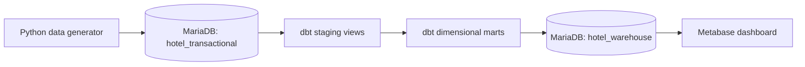
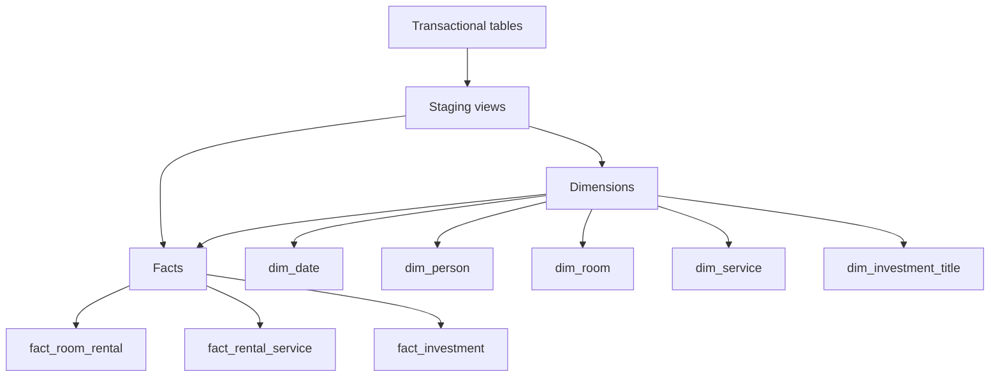

# Architecture

```mermaid
flowchart LR
    A[Python data generator] --> B[(MariaDB: hotel_transactional)]
    B --> C[dbt staging views]
    C --> D[dbt dimensional marts]
    D --> E[(MariaDB: hotel_warehouse)]
    E --> F[Metabase dashboard]
```

## Warehouse layers

```mermaid
flowchart TB
    RAW[Transactional tables] --> STG[Staging views]
    STG --> DIM[Dimensions]
    STG --> FACT[Facts]
    DIM --> FACT

    DIM --> D1[dim_date]
    DIM --> D2[dim_person]
    DIM --> D3[dim_room]
    DIM --> D4[dim_service]
    DIM --> D5[dim_investment_title]

    FACT --> F1[fact_room_rental]
    FACT --> F2[fact_rental_service]
    FACT --> F3[fact_investment]
```
